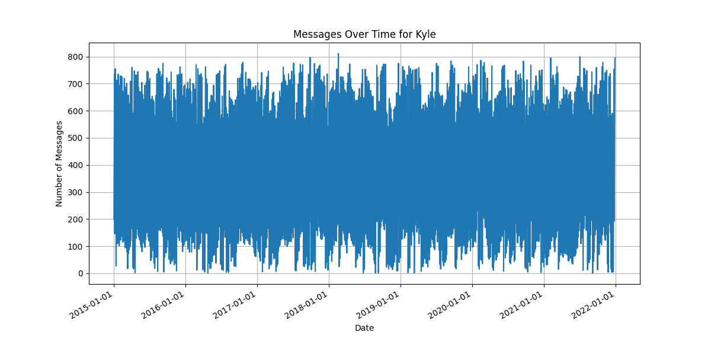

# CSV Message Pattern Analyzer

A Python tool for analyzing message patterns in large CSV datasets. This tool processes large files using chunk processing and provides chart visualizations of messaging patterns over time.

## Features
- Process large CSV files using chunk-based reading
- Interactive command-line interface for name input
- Analyze message patterns and frequencies
- Generate time-series visualizations
- Memory-efficient data processing

## Sample Data Format

The tool is designed to work with CSV files containing message data in the following format:

| Sender  | Receiver  | Date       | Time     | Message                                            |
|---------|-----------|------------|----------|----------------------------------------------------|
| Jojo    | Kyle      | 2015-01-01 | 00:00:01 | Not interested                                     |
| Tyler   | Denise    | 2015-01-01 | 00:00:02 | Eat mop                                            |
| Daniel  | Robin     | 2015-01-01 | 00:00:02 | Did you ever hear the tragedy of Darth Plaguei...  |
| Alice   | Kyle      | 2015-01-01 | 00:00:02 | I have a boyfiend                                  |
| Denise  | Tyler     | 2015-01-01 | 00:00:03 | Whose there                                        |
| Kevin   | Charlotte | 2015-01-01 | 00:00:04 | Are you a time traveler? Because I can see you...  |
| Ricky   | Ariana    | 2015-01-01 | 00:00:06 | Are you a loan? You've got my interest.            |

## Example Output

*Example visualization showing message frequency over time*

## Installation
1. Clone the repository
```bash
git clone https://github.com/MarcellusL/CSV-Message-Pattern-Analyzer.git
```
2. Create a virtual environment: `python -m venv venv`
3. Activate the virtual environment:
   - Windows: `.\venv\Scripts\activate`
   - Unix/MacOS: `source venv/bin/activate`
4. Install dependencies: `pip install -r requirements.txt`

## Usage
Run `python main.py` and follow the prompts to:
- Enter names to analyze
- View CSV preview
- Generate message statistics
- Create visualizations

## Technologies Used
- Python 3.10.11
- pandas for CSV processing
- matplotlib for visualization
- datetime for data handling and time-series analysis